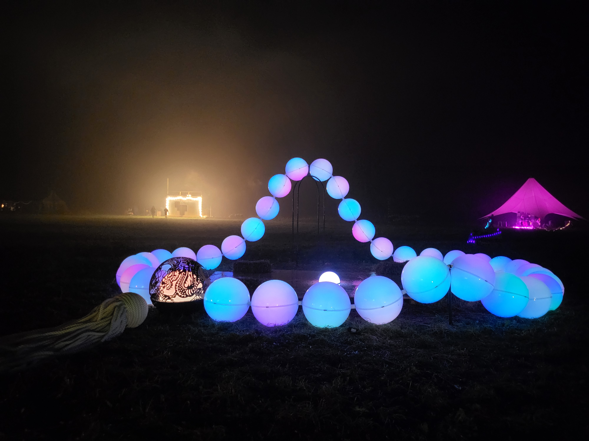
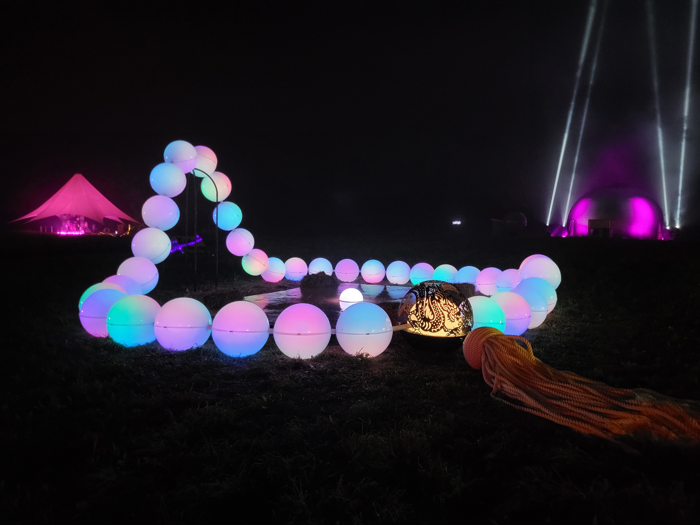

# Pearl Rosary Art
This is the code for the Pearl Rosary installation art project.

## What it does 
This is an interactive art installation, the button in the middle let's you 
change a color of each sphere one by one.
When all of the spheres are the same color, you switch to the next circle. 
When you reach the last circle, everything resets.
You can hold the button for 3 second to reset manually. 
If you keep holding it after reset for 3 more seconds, you enter
audio visualisation mode, where sphere change their brightness based on the level of base in the music. 
Audio signal comes from the AUX cable.
To exit audio mode, just press the button once.

## How to use the code
If you are using Arduino IDE, then change `.cpp` extention to `.ino`.

If you are using PlatformIO, then just change your `main.cpp` to this file.

## Requirements
[FastLed](https://github.com/FastLED/FastLED) and [ArduinoFHT](https://github.com/Evg33/ArduinoFHT) 
libraries are required for this program. Install them via your library manager.

## Warning
ArduinoFHT and many leds use quite a bit of RAM, so this project doesn't work on 
ATmega328P (Arduino Uno/Nano). Use something like Mega2560 instead.

